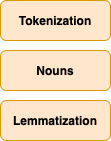
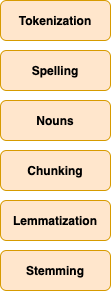

# Opinion mining

The goal of this project is to mine user opinions about certain product features. The task will use a dataset of user reviews of several Amazon products. The goal is to analyze the reviews, extract product features and calculate sentiment per each feature. All the discussed source code is included in a [Jupyter notebook](./opinion_mining.ipynb) and briefly described in an appendix of this document. This document is structured in the following way: quick look at the datasets, overview of the solution architecture, baseline model with the first results and finally the improved model and comparison with the baseline model. In the appendix there are some pointers with regards to the source code and some additional complementary information.

## The first look at the data

The data is a collection of customer reviews, extracted from Amazon. Reviews for individual products are grouped in files and each file has been manually labelled with the list of product features, sentiment polarity and sentiment strength. Each file contains reviews for one specific product or domain. 

Symbols used in the annotated reviews (from Customer_review_data/Readme.txt): 
```text
  [t]: the title of the review: Each [t] tag starts a review. 
       We did not use the title information in our papers.
  xxxx[+|-n]: xxxx is a product feature. 
      [+n]: Positive opinion, n is the opinion strength: 3 strongest, 
            and 1 weakest. Note that the strength is quite subjective. 
            You may want ignore it, but only considering + and -
      [-n]: Negative opinion
  ##  : start of each sentence. Each line is a sentence. 
  [u] : feature not appeared in the sentence.
  [p] : feature not appeared in the sentence. Pronoun resolution is needed.
  [s] : suggestion or recommendation.
  [cc]: comparison with a competing product from a different brand.
  [cs]: comparison with a competing product from the same brand.

```

Important some of the files do not provide separation between different reviews. This is handled in the model by treating individual lines as individual reviews.

## Architecture of the opinion miner

### Internal representation

The internal representation of both, the baseline and the upgraded model is built on top of the same architecture. They differ in the individual steps in the preprocessing, feature extraction or sentiment analysis pipeline and share the same internal representation. The main classes representing the  state of the model are based on the NLTK review reader module [2] and have been extended by my own classes to optimally store the internal state. The three core components are:

 

### Workflow

There are three stages in the workflow and the first and the second stage differ between different models:
1. Data preparation
    1. Reviews are parsed by either the NLTK parser or the manual parser and stored in memory
    2. Each review is preprocessed according to the parameters chosen by the model. The result of the preprocessing is stored in the model ready for the next stage. Possible preprocessing steps include:
        1. Tokenization
        2. POS tagging (for later noun and noun phrase extraction)
        3. Spelling auto-correct (attempting to correct simple spelling mistakes)
        4. Chunking (noun phrase extraction)
        5. Lemmatization
        6. Stemming        
2. Model Building & Training
    1. Product feature mining include single or multiple steps from this list:
        1. Keyword extraction based on TFIDF
        2. Frequent item sets (Apriori algorithm)
        3. Feature pruning according to compactness, redundancy and heuristics
3. Deployment and evaluation of results
    1. Evaluation of the feature mining comparing to the annotated set
        1. Recall, Precision and F-score per sentence
        2. Recall, Precision and F-score per product feature set
    2. Evaluation of the sentiment analysis comparing to the annotated set
        1. Recall, Precision and F-score

 

## Baseline model and the first results

To get the first feel of the task ahead and establish a point of comparison a baseline model has been built. It uses the basic subset of the aforementioned steps. This model has been then tested on multiple product datasets and the success has been evaluated and reported at the end of this section.

The main components of the baseline model can be seen on this diagram:


### Preprocessing

The preprocessing pipeline is clean and as simple as possible with three main steps (and smaller steps described below):



#### Tokenization 
Since the NLTK review module is used the product reviews already come partially preprocessed. Each review is split by sentence and the words are tokenized. The default split and tokenization was left as is.

#### Part-of-speech tagging
 For tagging parts of speech two different taggers were tried and the TextBlob PatternTagger[4] was chosen since it performed very well. The list of supported tags are available in the appendix section.

#### Extraction of nouns
In the second step (nouns) POS tagging is used to extract nouns from the sentence. The logic behind it is that the product features are mostly nouns or noun phrases (and rarely verbs, adverbs and other parts of the speech). Nouns are extracted out of the text and stored separately for each of the product lines.  [1] Other parts of speech are dropped in this stage. 

The following POS entities indicate the nouns:
* NN noun, singular ‘desk’
* NNS noun plural ‘desks’
* NNP proper noun, singular ‘Harrison’
* NNPS proper noun, plural ‘Americans’ 
    
#### Prunning short words
Most of the very short words are various pronouns, typos and abbreviations. These will less likely present product features so all the words that are shorter than 3 characters are removed. This also has a slightly negative effect of prunning potential multi-word feature names indicating product types for example (Canon G3 camera) however the benefit was still greater than the loss of recall.
    
### Mining for the product features

For the first attempt at mining for the product features a simple term frequency approach was used. Considering each review to be one document a matrix of TF-IDF values was generated for all the nouns in the review dataset. Then the top N terms with the highest TFIDF value were picked as potential product features candidates. In the baseline model only unigrams were considered when building the TFIDF matrix and each term had to appear in at least 3% of reviews and not more that 80% of reviews. Several settings were tested and these values proved to be optimal accross the list of the given test products. The SciKit's TfidfVectorizer implementation was used to construct the feature matrix and a separate function to extract the top N features. Various

After the features are extracted all review sentences containing one or multiple features are tagged.

### Sentiment Analysis with Naive Bayes classifier

In the baseline model the sentiment analysis is run per each sentence containing one or more features but not distinguishing different features in the sentence. Therefore in the case when a sentence contains more than one feature all of the features would share the sentiment score.

The sentiment analyzer implementation has been pretrained on the movie review corpus in English [5]. The product review datasets are relatively small and the expectation was that training the analyzer on the movie review dataset would be better. For classification the Naive Bayes classifier is used.

### Evaluating results of the baseline model

The baseline model is simple, however it should offer some point of comparison. When evaluating the results, each mined feature is compared to the list of features in the annotated dataset. The evaluation is first done on the complete list of features and then also in the per-review basis. The mined features have to exactly match the annotated features, otherwise it does not count. This reduces the success of the model somewhat since there are many occasions where word order is inverted and thus the recall is lower as 

#### Feature mining evaluation

In the feature mining phase the baseline model didn't do very well which was somewhat expected. Here only unigram nouns are considered, not even noun phrases and any deeper relationships between words were ignored. The focus was solely on the term frequency / inverse document frequency.

Even here interestingly a notable difference was achieved just by fiddling around with the cutoff values for the TFIDF matrix - below the difference between ignoring terms appearing in more than 95% of documents / less than 10% and the best performing values of 80% / 3% resulting in more than double true positives and also more false positives.

TFIDF max_df=0.95, min_df=0.1

|	Name	|	TP	|	FN	|	FP	|	Recall	|	Precision	|	F-score	|
|:---|:---:|:---:|:---:|:---:|:---:|:---:|
|	Apex_AD2600_Progressive_scan_DVD player.txt	|	10	|	105	|	3	|	0.09	|	0.77	|	0.16	|
|	Canon_G3.txt	|	10	|	95	|	10	|	0.10	|	0.50	|	0.16	|
|	Creative_Labs_Nomad_Jukebox_Zen_Xtra_40GB.txt	|	13	|	175	|	7	|	0.07	|	0.65	|	0.12	|
|	Nikon_coolpix_4300.txt	|	6	|	69	|	14	|	0.08	|	0.30	|	0.13	|
|	Nokia_6610.txt	|	12	|	99	|	8	|	0.11	|	0.60	|	0.18	|
|	Canon_PowerShot_SD500.txt	|	3	|	77	|	0	|	0.04	|	1.00	|	0.07	|
|	Canon_S100.txt	|	7	|	105	|	3	|	0.06	|	0.70	|	0.11	|
|	Diaper_Champ.txt	|	9	|	78	|	11	|	0.10	|	0.45	|	0.17	|
|	Hitachi_router.txt	|	10	|	87	|	10	|	0.10	|	0.50	|	0.17	|
|	Linksys_Router.txt	|	10	|	91	|	9	|	0.10	|	0.53	|	0.17	|
|	MicroMP3.txt	|	8	|	206	|	12	|	0.04	|	0.40	|	0.07	|
|	Nokia_6600.txt	|	13	|	165	|	5	|	0.07	|	0.72	|	0.13	|
|	Average values	|	**9.25**	|	**112.67**	|	**7.67**	|	**0.08**	|	**0.59**	|	**0.14**	|

TFIDF max_df=0.8, min_df=0.03

|	Name	|	TP	|	FN	|	FP	|	Recall	|	Precision	|	F-score	|
|:---|:---:|:---:|:---:|:---:|:---:|:---:|
|	Apex_AD2600_Progressive_scan_DVD player.txt	|	33	|	82	|	52	|	0.29	|	0.39	|	0.33	|
|	Canon_G3.txt	|	25	|	80	|	61	|	0.24	|	0.29	|	0.26	|
|	Creative_Labs_Nomad_Jukebox_Zen_Xtra_40GB.txt	|	35	|	153	|	58	|	0.19	|	0.38	|	0.25	|
|	Nikon_coolpix_4300.txt	|	11	|	64	|	77	|	0.15	|	0.12	|	0.13	|
|	Nokia_6610.txt	|	27	|	84	|	62	|	0.24	|	0.30	|	0.27	|
|	Canon_PowerShot_SD500.txt	|	6	|	74	|	2	|	0.07	|	0.75	|	0.14	|
|	Canon_S100.txt	|	25	|	87	|	45	|	0.22	|	0.36	|	0.27	|
|	Diaper_Champ.txt	|	17	|	70	|	50	|	0.20	|	0.25	|	0.22	|
|	Hitachi_router.txt	|	17	|	80	|	31	|	0.18	|	0.35	|	0.23	|
|	Linksys_Router.txt	|	21	|	80	|	64	|	0.21	|	0.25	|	0.23	|
|	MicroMP3.txt	|	26	|	188	|	62	|	0.12	|	0.30	|	0.17	|
|	Nokia_6600.txt	|	34	|	144	|	47	|	0.19	|	0.42	|	0.26	|
|	Average values	|	**23.08**	|	**98.83**	|	**50.92**	|	**0.19**	|	**0.35**	|	**0.23**	|

Results of detecting features per each line of the product gives a more realistic overview of how the model would perform on real-life data. Here each sentence was counted separately into the final statistic so that if certain feature was more common it had a greater effect on the final result. This result tells less about success of the feature mining but gives a slightly more realistic view of the expected performance in real-life applications where the certain features might be more prominent than others:

|	Name	|	TP	|	FN	|	FP	|	Recall	|	Precision	|	F-score	|
|:---|:---:|:---:|:---:|:---:|:---:|:---:|
|	Apex_AD2600_Progressive_scan_DVD player.txt	|	128	|	302	|	1060	|	0.30	|	0.11	|	0.16	|
|	Canon_G3.txt	|	90	|	195	|	962	|	0.32	|	0.09	|	0.13	|
|	Creative_Labs_Nomad_Jukebox_Zen_Xtra_40GB.txt	|	323	|	522	|	2502	|	0.38	|	0.11	|	0.18	|
|	Nikon_coolpix_4300.txt	|	57	|	146	|	611	|	0.28	|	0.09	|	0.13	|
|	Nokia_6610.txt	|	90	|	248	|	598	|	0.27	|	0.13	|	0.18	|
|	Canon_PowerShot_SD500.txt	|	43	|	105	|	122	|	0.29	|	0.26	|	0.27	|
|	Canon_S100.txt	|	90	|	132	|	383	|	0.41	|	0.19	|	0.26	|
|	Diaper_Champ.txt	|	67	|	171	|	565	|	0.28	|	0.11	|	0.15	|
|	Hitachi_router.txt	|	91	|	174	|	309	|	0.34	|	0.23	|	0.27	|
|	Linksys_Router.txt	|	85	|	133	|	792	|	0.39	|	0.10	|	0.16	|
|	MicroMP3.txt	|	129	|	452	|	1177	|	0.22	|	0.10	|	0.14	|
|	Nokia_6600.txt	|	165	|	292	|	637	|	0.36	|	0.21	|	0.26	|
|	Average values	|	**113.17**	|	**239.33**	|	**809.83**	|	**0.32**	|	**0.14**	|	**0.19**	|

#### Sentiment Analysis evaluation

The result of the sentiment analysis shows considerably better results than the mining for the product features. The results could still be improved since this approach has two obvious flaws: 
* it is using a Naive-Bayes classifier trained on the movie review dataset.
* sentiment is calculated per whole sentence even when a sentence contains more than one feature. For example, if two separate features (flash, lens) are found in a sentence the sentiment is assigned to them both 


|	Name	|	TP	|	FN	|	FP	|	Recall	|	Precision	|	F-score	|
|:---|:---:|:---:|:---:|:---:|:---:|:---:|
|	Apex_AD2600_Progressive_scan_DVD player.txt	|	45	|	6	|	42	|	0.88	|	0.52	|	0.65	|
|	Canon_G3.txt	|	48	|	9	|	8	|	0.84	|	0.86	|	0.85	|
|	Creative_Labs_Nomad_Jukebox_Zen_Xtra_40GB.txt	|	162	|	27	|	42	|	0.86	|	0.79	|	0.82	|
|	Nikon_coolpix_4300.txt	|	39	|	5	|	2	|	0.89	|	0.95	|	0.92	|
|	Nokia_6610.txt	|	83	|	18	|	5	|	0.82	|	0.94	|	0.88	|
|	Canon_PowerShot_SD500.txt	|	34	|	5	|	0	|	0.87	|	1.00	|	0.93	|
|	Canon_S100.txt	|	36	|	9	|	7	|	0.80	|	0.84	|	0.82	|
|	Diaper_Champ.txt	|	23	|	15	|	7	|	0.61	|	0.77	|	0.68	|
|	Hitachi_router.txt	|	53	|	19	|	12	|	0.74	|	0.82	|	0.77	|
|	Linksys_Router.txt	|	39	|	9	|	8	|	0.81	|	0.83	|	0.82	|
|	MicroMP3.txt	|	44	|	7	|	14	|	0.86	|	0.76	|	0.81	|
|	Nokia_6600.txt	|	81	|	13	|	15	|	0.86	|	0.84	|	0.85	|
|	Average values	|	**57.25**	|	**11.83**	|	**13.50**	|	**0.82**	|	**0.83**	|	**0.82**	|


#### Example of a generated report

After the processing is done a report is generated listing positive and negative features per product. The report is sorted by the most reviews per feature and prunned to display only the first N features (this can be changed). Here the resulting list is prunned to only give the first 4 features:

Product:  Nokia_6610.txt
	
* Feature:  service
  * Positive:  11
  * Negative:  6
	
* Feature:  mobile service
  * Positive:  7
  * Negative:  2
	
* Feature:  feature
  * Positive:  32
  * Negative:  5
	
* Feature:  phone
  * Positive:  130
  * Negative:  38
	

## Improving the baseline model

Many small improvements were tested against the baseline model. One of the most obvious ones is including bigrams and trigrams as the feature candidates. The product features are frequently made up of multiple words or phrases, e.g. camera lens, flash mount, battery life, so it makes sense to include them as well. However this introduces new challenges with distinguishing between more general and specific versions of the same feature. This is tackled in the feature prunning stage, which has been added after the feature mining step. Mining for the frequent item sets was also added and is discussed in more detail in a separate section. And lastly the product review are messy and full of mistakes so one additional step was introduced, where each word is checked for typos in the preprocessing stage.
 
 ### Spelling correction and extended preprocessing
 
 The spelling corrector in TextBlob was used to attempt to correct the typos in the text of reviews [3]. It attempts to choose the most likely spelling correction for a word that has been edited. An edit can be deletion, swapping (of adjacent letters), replacement or insertion of a letter. One or two edits are considered. The language model is based on about million words from public domain books, Wiktionary and British National Corpus [7].
 
 Part of the improvements were done in the preprocessing step per each review line. The preprocessing pipeline now consists of the following steps:




Alone adding the spell check, noun phrases / bigrams and trigrams as potential features improved the results by increasing recall by 3% and decreasing precision by 1%:

|	Name	|	TP	|	FN	|	FP	|	Recall	|	Precision	|	F-score	|
|:---|:---:|:---:|:---:|:---:|:---:|:---:|
|	Apex_AD2600_Progressive_scan_DVD player.txt	|	38	|	77	|	49	|	0.33	|	0.44	|	0.38	|
|	Canon_G3.txt	|	30	|	75	|	55	|	0.29	|	0.35	|	0.32	|
|	Creative_Labs_Nomad_Jukebox_Zen_Xtra_40GB.txt	|	45	|	143	|	46	|	0.24	|	0.49	|	0.32	|
|	Nikon_coolpix_4300.txt	|	21	|	54	|	59	|	0.28	|	0.26	|	0.27	|
|	Nokia_6610.txt	|	37	|	74	|	52	|	0.33	|	0.42	|	0.37	|
|	Canon_PowerShot_SD500.txt	|	7	|	73	|	3	|	0.09	|	0.70	|	0.16	|
|	Canon_S100.txt	|	19	|	93	|	52	|	0.17	|	0.27	|	0.21	|
|	Diaper_Champ.txt	|	18	|	69	|	60	|	0.21	|	0.23	|	0.22	|
|	Hitachi_router.txt	|	20	|	77	|	54	|	0.21	|	0.27	|	0.23	|
|	Linksys_Router.txt	|	21	|	80	|	74	|	0.21	|	0.22	|	0.21	|
|	MicroMP3.txt	|	30	|	184	|	61	|	0.14	|	0.33	|	0.20	|
|	Nokia_6600.txt	|	36	|	142	|	56	|	0.20	|	0.39	|	0.27	|
|	Average values	|	**26.83**	|	**95.08**	|	**51.75**	|	**0.22**	|	**0.36**	|	**0.26**	|


### Apriori - mining frequent item sets

The next improvement that had the highest impact was introducing the Apriori algorithm [6] to mine for the frequent item sets. Apriori is designed to operate on databases containing transactions (for example, collections of items bought by customers, or details of a website frequentation or IP addresses).[8] In our case the itemset is defined as frequent if it appears in more than 0.3% of the review lines. Apriori was designed to operate on transactions so in the case of the product reviews one transaction equals one review line. The association rule part of the algorithm is ignored and only the frequent item sets are extracted [1]

Including feature candidates mined by the Apriori algorithm considerably improved the results of the feature mining considerably:

|	Name	|	TP	|	FN	|	FP	|	Recall	|	Precision	|	F-score	|
|:---|:---:|:---:|:---:|:---:|:---:|:---:|
|	Apex_AD2600_Progressive_scan_DVD player.txt	|	45	|	70	|	191	|	0.39	|	0.19	|	0.26	|
|	Canon_G3.txt	|	51	|	54	|	596	|	0.49	|	0.08	|	0.14	|
|	Creative_Labs_Nomad_Jukebox_Zen_Xtra_40GB.txt	|	52	|	136	|	135	|	0.28	|	0.28	|	0.28	|
|	Nikon_coolpix_4300.txt	|	32	|	43	|	291	|	0.43	|	0.10	|	0.16	|
|	Nokia_6610.txt	|	54	|	57	|	349	|	0.49	|	0.13	|	0.21	|
|	Average values	|	**46.80**	|	**72.00**	|	**312.40**	|	**0.41**	|	**0.16**	|	**0.21**	|

In the upper table only the first 6 products were included due to increased time of computing required due to the Apriori algorithm. For easier comparison the table from before (without frequent item sets mining) is included just for these six products:

|	Name	|	TP	|	FN	|	FP	|	Recall	|	Precision	|	F-score	|
|:---|:---:|:---:|:---:|:---:|:---:|:---:|
|	Apex_AD2600_Progressive_scan_DVD player.txt	|	38	|	77	|	49	|	0.33	|	0.44	|	0.38	|
|	Canon_G3.txt	|	30	|	75	|	55	|	0.29	|	0.35	|	0.32	|
|	Creative_Labs_Nomad_Jukebox_Zen_Xtra_40GB.txt	|	45	|	143	|	46	|	0.24	|	0.49	|	0.32	|
|	Nikon_coolpix_4300.txt	|	21	|	54	|	59	|	0.28	|	0.26	|	0.27	|
|	Nokia_6610.txt	|	37	|	74	|	52	|	0.33	|	0.42	|	0.37	|
|	Average values	|	**34.20**	|	**84.60**	|	**52.20**	|	**0.29**	|	**0.39**	|	**0.33**	|

By comparing these two tables it can be seen the increase of recall by roughly 12% by including the frequent item sets. Adding the frequent item sets doesn't consider the position of a word in a sentence and this poses a new challenge of prunning the feature candidates that have little sense. Some words combinations returned by the Apriori will not be sensible and the best way to remove the is the feature prunning approach discussed in the following section. 

### Removing useless features

After adding bigrams and trigram as well as the frequent item sets there are many redundant and weird looking feature candidates that need to be removed. For this reason a new prunning step has been added in the improved model that runs after the feature mining has collected the feature candidates and attempts to reduce the amount of bad feature candidates. Using the two methods below approximatelly 23% of feature candidates get removed.

#### Redundancy prunning
 
All the features are first separated on the base of the number of words they consist of. Single word features are considered to be a general version of the multiple word features if the multiple word feature contains the single word feature. For example a digital camera might indicate the same feature as camera in specific cases. In other cases the general word will have no sense at all as in the case of batter life vs life. Here the approach described in [1] was followed and the features were prunned based on their p-support, ie the number of times they occur in sentences on their own vs with another feature. 

### Compactness prunning

Features from the Apriori frequent item set mining could be combination of words that are otherwise relatively far apart in a sentence. These kind of features might not be the best candidates so they are also removed. The main criterium is the distance of the words in an original sentence. If the distance is too long then the feature is considered not compact. Since features can occure more than once in the same sentence all possible distances were calculated and then the minimum distance is considered. The treshold for prunning those features that are not "compact" is taken from [1] and distance of 3 words in at least two sentences is reused.

## Appendix

### Source code quick guide

All of the source code is available in the accompanying  [Jupyter notebook](./opinion_mining.ipynb)

#### Corpus, Review, Sentence representation

The classes are defined under the section names Internal state of the model. There are three classes:
1. PSent
2. PRev (most of preprocessing pipeline is here)
3. PReviews (feature mining, prunning, opinion words, evaluations)
 
 Each of these classes represents a review line, a review and a corpus of reviews accordingly.

#### Preprocessing pipeline

The preprocessing takes place inside the PRev class in the preprocess() method. Spelling, stemming, chunking and lemmatization can be controlled via the input parameters.

#### Product Feature mining

The feature mining is split between the simple TFIDF keyword extraction and the frequent itemsets mining by the Apriori algorithm:
1. features() in PReviews class 
2. get_tfidf_top_features() in PReviews class 
3. _tag_sentences_with_features() in PReviews class 

#### Product Feature prunning

The feature prunning is split between the redundancy and the compactness prunning and some additional heuristics included in the method prunning method:

1. feature_prunning() in PReviews class 
2. compactness_prunning() in PReviews class 
  
### TextBlob PatternTagger supported POS tags

````text
CC coordinating conjunction
CD cardinal digit
DT determiner
EX existential there (like: “there is” … think of it like “there exists”)
FW foreign word
IN preposition/subordinating conjunction
JJ adjective ‘big’
JJR adjective, comparative ‘bigger’
JJS adjective, superlative ‘biggest’
LS list marker 1)
MD modal could, will
NN noun, singular ‘desk’
NNS noun plural ‘desks’
NNP proper noun, singular ‘Harrison’
NNPS proper noun, plural ‘Americans’
PDT predeterminer ‘all the kids’
POS possessive ending parent‘s
PRP personal pronoun I, he, she
PRP$ possessive pronoun my, his, hers
RB adverb very, silently,
RBR adverb, comparative better
RBS adverb, superlative best
RP particle give up
TO to go ‘to‘ the store.
UH interjection errrrrrrrm
VB verb, base form take
VBD verb, past tense took
VBG verb, gerund/present participle taking
VBN verb, past participle taken
VBP verb, sing. present, non-3d take
VBZ verb, 3rd person sing. present takes
WDT wh-determiner which
WP wh-pronoun who, what
WP$ possessive wh-pronoun whose
WRB wh-abverb where, when
```` 

  
  
  [1]: https://www.cs.uic.edu/~liub/publications/aaai04-featureExtract.pdf "Liu, Hu, Mining Opinion Features in Customer Reviews"
  [2]: https://www.nltk.org/howto/corpus.html "NLTK product reviews corpus"
  [3]: https://textblob.readthedocs.io/en/dev/ "TextBlob: Simplified Text Processing"
  [4]: https://textblob.readthedocs.io/en/dev/advanced_usage.html "TextBlob Advanced Usage" 
  [5]: https://github.com/sloria/TextBlob/blob/e75a54ebe02d4f360fb2ebfde2741135209a8ede/textblob/en/sentiments.py "TextBlob Sentiment Analyzer Source Code"
  [6]: https://pypi.org/project/apyori/ "Apyori implementation of Apriori algorithm"
  [7]: https://norvig.com/spell-correct.html "Peter Norvig, 2007, How to Write a Spelling Corrector"
  [8]: https://en.wikipedia.org/wiki/Apriori_algorithm "Apriori algorithm"