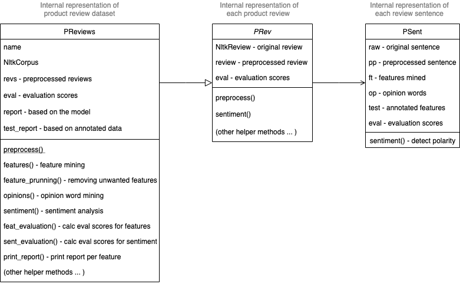
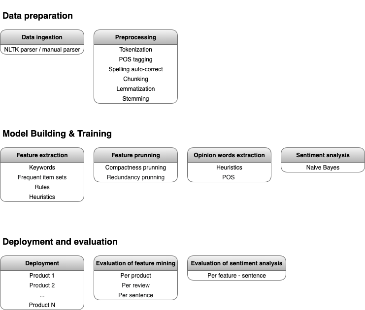

# Opinion mining

## The first look at the data

The data is a collection of customer reviews, extracted from Amazon. Reviews for individual products are grouped in files and each file has been manually labelled with the list of product features, sentiment polarity and sentiment strength. Each file contains reviews for one specific product or domain. 

Symbols used in the annotated reviews (from Customer_review_data/Readme.txt): 
```text
  [t]: the title of the review: Each [t] tag starts a review. 
       We did not use the title information in our papers.
  xxxx[+|-n]: xxxx is a product feature. 
      [+n]: Positive opinion, n is the opinion strength: 3 strongest, 
            and 1 weakest. Note that the strength is quite subjective. 
            You may want ignore it, but only considering + and -
      [-n]: Negative opinion
  ##  : start of each sentence. Each line is a sentence. 
  [u] : feature not appeared in the sentence.
  [p] : feature not appeared in the sentence. Pronoun resolution is needed.
  [s] : suggestion or recommendation.
  [cc]: comparison with a competing product from a different brand.
  [cs]: comparison with a competing product from the same brand.

```

Important some of the files do not provide separation between different reviews. This is handled in the model by treating individual lines as individual reviews.

## Architecture of the opinion miner

### Internal representation

The internal representation of both, the baseline and the upgraded model is built on top of the same architecture. They differ in the individual steps in the preprocessing, feature extraction or sentiment analysis pipeline and share the same internal representation. The main classes representing the  state of the model are based on the NLTK review reader module [2] and have been extended by my own classes to optimally store the internal state. The three core components are:

 

### Workflow

There are three stages in the workflow and the first and the second stage differ between different models:
1. Data preparation
    1. Reviews are parsed by either the NLTK parser or the manual parser and stored in memory
    2. Each review is preprocessed according to the parameters chosen by the model. The result of the preprocessing is stored in the model ready for the next stage. Possible preprocessing steps include:
        1. Tokenization
        2. POS tagging (for later noun and noun phrase extraction)
        3. Spelling auto-correct (attempting to correct simple spelling mistakes)
        4. Chunking (noun phrase extraction)
        5. Lemmatization
        6. Stemming        
2. Model Building & Training
    1. Product feature mining include single or multiple steps from this list:
        1. Keyword extraction based on TFIDF
        2. Frequent item sets (Apriori algorithm)
        3. Feature pruning according to rules and heuristics
3. Deployment and evaluation of results
    1. Evaluation of the feature mining comparing to the annotated set
        1. Recall, Precision and F-score per sentence
        2. Recall, Precision and F-score per product feature set
    2. Evaluation of the sentiment analysis comparing to the annotated set
        1. Recall, Precision and F-score

 

## Baseline model and the first results

To establish a point of comparison a baseline model has been built with the basic subset of the aforementioned steps. The baseline model has been run on multiple products to collect results of mining for the product features and sentiment analysis.


### Preprocessing

In the baseline model the preprocessing pipeline is clean and as simple as possible:

#### Tokenization 
Since the NLTK review module is used the product reviews already come partially preprocessed. Each review is split by sentence and the words are tokenized. The default split and tokenization was left as is.
#### Part-of-speech tagging
For tagging parts of speech two different taggers were tried and the TextBlob PatternTagger[4] was chosen since it performed very well. The list of supported tags are available in the appendix section.

#### Extraction of nouns
Since product features are usually nouns or noun phrases in review sentences [1] all parts of speech are dropped in this stage and only nouns retained. 

The following POS entities indicate the nouns:
    1. NN noun, singular ‘desk’
    2. NNS noun plural ‘desks’
    3. NNP proper noun, singular ‘Harrison’
    4. NNPS proper noun, plural ‘Americans’ 
    
#### Prunning short words
Most of the very short words are various pronouns, typos and abbreviations. In this stage words that are shorter than 3 characters are removed. 
    
### Mining for the product features

A matrix of TF-IDF features is used to retain only the relevant keywords, potential product features candidates. For the baseline model those unigrams are considered that appear in at least 10% of reviews and not more that 90% of reviews. The SciKit's TfidfVectorizer implementation is used to construct the feature matrix.

After the features are extracted all review sentences containing one or multiple features are tagged.

### Sentiment Analysis with Naive Bayes classifier

In the baseline model the sentiment analysis is run per each sentence containing one or more features but not distinguishing different features in the sentence. Therefore in the case when a sentence contains more than one feature all of the features would share the sentiment score.

The sentiment analyzer implementation has been pretrained on the movie review corpus in English [5]. The product review datasets are relatively small and the expectation was that training the analyzer on the movie review dataset would be better. For classification the Naive Bayes classifier is used.

### Evaluating results of the baseline model

#### Feature mining evaluation

Results of the overall set of features (each feature counted once per product):

|	Name	|	TP	|	FN	|	FP	|	Recall	|	Precision	|	F-score	|
|:---|:---:|:---:|:---:|:---:|:---:|:---:|
|	Apex_AD2600_Progressive_scan_DVD player.txt	|	10	|	105	|	3	|	0.09	|	0.77	|	0.16	|
|	Canon_G3.txt	|	10	|	95	|	10	|	0.10	|	0.50	|	0.16	|
|	Creative_Labs_Nomad_Jukebox_Zen_Xtra_40GB.txt	|	13	|	175	|	7	|	0.07	|	0.65	|	0.12	|
|	Nikon_coolpix_4300.txt	|	6	|	69	|	14	|	0.08	|	0.30	|	0.13	|
|	Nokia_6610.txt	|	12	|	99	|	8	|	0.11	|	0.60	|	0.18	|
|	Canon_PowerShot_SD500.txt	|	3	|	77	|	0	|	0.04	|	1.00	|	0.07	|
|	Canon_S100.txt	|	7	|	105	|	3	|	0.06	|	0.70	|	0.11	|
|	Diaper_Champ.txt	|	9	|	78	|	11	|	0.10	|	0.45	|	0.17	|
|	Hitachi_router.txt	|	10	|	87	|	10	|	0.10	|	0.50	|	0.17	|
|	Linksys_Router.txt	|	10	|	91	|	9	|	0.10	|	0.53	|	0.17	|
|	MicroMP3.txt	|	8	|	206	|	12	|	0.04	|	0.40	|	0.07	|
|	Nokia_6600.txt	|	13	|	165	|	5	|	0.07	|	0.72	|	0.13	|
|	Average values	|	**9.25**	|	**112.67**	|	**7.67**	|	**0.08**	|	**0.59**	|	**0.14**	|

Results of detecting features per each line of the product gives a more realistic overview of how the model would perform on real-life data:

|	Name	|	TP	|	FN	|	FP	|	Recall	|	Precision	|	F-score	|
|:---|:---:|:---:|:---:|:---:|:---:|:---:|
|	Apex_AD2600_Progressive_scan_DVD player.txt	|	93	|	337	|	430	|	0.22	|	0.18	|	0.20	|
|	Canon_G3.txt	|	65	|	220	|	533	|	0.23	|	0.11	|	0.15	|
|	Creative_Labs_Nomad_Jukebox_Zen_Xtra_40GB.txt	|	231	|	614	|	1260	|	0.27	|	0.15	|	0.20	|
|	Nikon_coolpix_4300.txt	|	46	|	157	|	343	|	0.23	|	0.12	|	0.16	|
|	Nokia_6610.txt	|	106	|	232	|	381	|	0.31	|	0.22	|	0.26	|
|	Canon_PowerShot_SD500.txt	|	39	|	109	|	92	|	0.26	|	0.30	|	0.28	|
|	Canon_S100.txt	|	52	|	170	|	173	|	0.23	|	0.23	|	0.23	|
|	Diaper_Champ.txt	|	45	|	193	|	377	|	0.19	|	0.11	|	0.14	|
|	Hitachi_router.txt	|	84	|	181	|	261	|	0.32	|	0.24	|	0.28	|
|	Linksys_Router.txt	|	56	|	162	|	394	|	0.26	|	0.12	|	0.17	|
|	MicroMP3.txt	|	65	|	516	|	502	|	0.11	|	0.11	|	0.11	|
|	Nokia_6600.txt	|	109	|	348	|	336	|	0.24	|	0.24	|	0.24	|
|	Average values	|	**82.58**	|	**269.92**	|	**423.50**	|	**0.24**	|	**0.18**	|	**0.20**	|

#### Sentiment Analysis evaluation

|	Name	|	TP	|	FN	|	FP	|	Recall	|	Precision	|	F-score	|
|:---|:---:|:---:|:---:|:---:|:---:|:---:|
|	Apex_AD2600_Progressive_scan_DVD player.txt	|	45	|	6	|	42	|	0.88	|	0.52	|	0.65	|
|	Canon_G3.txt	|	48	|	9	|	8	|	0.84	|	0.86	|	0.85	|
|	Creative_Labs_Nomad_Jukebox_Zen_Xtra_40GB.txt	|	162	|	27	|	42	|	0.86	|	0.79	|	0.82	|
|	Nikon_coolpix_4300.txt	|	39	|	5	|	2	|	0.89	|	0.95	|	0.92	|
|	Nokia_6610.txt	|	83	|	18	|	5	|	0.82	|	0.94	|	0.88	|
|	Canon_PowerShot_SD500.txt	|	34	|	5	|	0	|	0.87	|	1.00	|	0.93	|
|	Canon_S100.txt	|	36	|	9	|	7	|	0.80	|	0.84	|	0.82	|
|	Diaper_Champ.txt	|	23	|	15	|	7	|	0.61	|	0.77	|	0.68	|
|	Hitachi_router.txt	|	53	|	19	|	12	|	0.74	|	0.82	|	0.77	|
|	Linksys_Router.txt	|	39	|	9	|	8	|	0.81	|	0.83	|	0.82	|
|	MicroMP3.txt	|	44	|	7	|	14	|	0.86	|	0.76	|	0.81	|
|	Nokia_6600.txt	|	81	|	13	|	15	|	0.86	|	0.84	|	0.85	|
|	Average values	|	**57.25**	|	**11.83**	|	**13.50**	|	**0.82**	|	**0.83**	|	**0.82**	|

## Improving the baseline model

### Mining for the frequent item sets
+ chunking
+ apriori
+ include bigrams and trigrams
+ expand the TFIDF top list from 20 to 50

## Appendix
  
### TextBlob PatternTagger supported POS tags

````text
CC coordinating conjunction
CD cardinal digit
DT determiner
EX existential there (like: “there is” … think of it like “there exists”)
FW foreign word
IN preposition/subordinating conjunction
JJ adjective ‘big’
JJR adjective, comparative ‘bigger’
JJS adjective, superlative ‘biggest’
LS list marker 1)
MD modal could, will
NN noun, singular ‘desk’
NNS noun plural ‘desks’
NNP proper noun, singular ‘Harrison’
NNPS proper noun, plural ‘Americans’
PDT predeterminer ‘all the kids’
POS possessive ending parent‘s
PRP personal pronoun I, he, she
PRP$ possessive pronoun my, his, hers
RB adverb very, silently,
RBR adverb, comparative better
RBS adverb, superlative best
RP particle give up
TO to go ‘to‘ the store.
UH interjection errrrrrrrm
VB verb, base form take
VBD verb, past tense took
VBG verb, gerund/present participle taking
VBN verb, past participle taken
VBP verb, sing. present, non-3d take
VBZ verb, 3rd person sing. present takes
WDT wh-determiner which
WP wh-pronoun who, what
WP$ possessive wh-pronoun whose
WRB wh-abverb where, when
```` 

  
  
## Product feature extraction
  
  - focusing on the explicitely mentioned features since the implicite ones are more rare.[1]
  
  
  [1] https://www.cs.uic.edu/~liub/publications/aaai04-featureExtract.pdf "Liu, Hu, Mining Opinion Features in Customer Reviews"
  [2] https://www.nltk.org/howto/corpus.html "NLTK product reviews corpus"
  [3] https://textblob.readthedocs.io/en/dev/ "TextBlob: Simplified Text Processing"
  [4] https://textblob.readthedocs.io/en/dev/advanced_usage.html "TextBlob Advanced Usage" 
  [5] https://github.com/sloria/TextBlob/blob/e75a54ebe02d4f360fb2ebfde2741135209a8ede/textblob/en/sentiments.py "TextBlob Sentiment Analyzer Source Code"